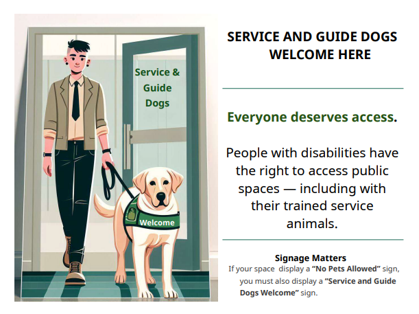

# 📖 Accessibility Resources by Ann K. Chou  
*Welcome to a lantern-lit space of access, creativity, and co-care.*

This repository holds living resources designed to support inclusive communication across abilities — especially for blind, deaf, hard-of-hearing, neurodivergent, and community-rooted collaborators.

---

## 🌟 Access as Care, Not Accommodation

These materials were born from the inside.

As someone who is **hard of hearing and neurodiverse**, my earliest guides focused on communication accessibility for conversations, meetings, and creative workspaces. Initially created for in-person gatherings, they offered practical tools and affirming language for clearer, kinder collaboration.

During the COVID-19 pandemic, online spaces opened up new possibilities for cross-disability connection — and my guides began to evolve. Collaborating with other disabled creatives, we shaped tools grounded in **interdependence**, **sensory care**, **anti-stigma language**, and **shared access culture**.

When the director of my **UBC Behavioural Insight Foundation course** asked for my communication guide — after noticing it in my email signature — I understood how these resources could travel beyond disability circles. They belong to anyone cultivating dignity in how we meet, create, and collaborate.

---

## 📚 Contents

### 📝 Written Guides  
- [accessibility_rider.md](https://github.com/AnnChou/creative-access-guide/blob/main/accessibility_rider.md) – accessibility rider for workshops and ### 📝 Written Guides  
- [accessibility_rider.md](https://github.com/AnnChou/creative-access-guide/blob/main/accessibility_rider.md) – access rider for workshops and mixed-modality gatherings  
- [etiquette_guide.md](https://github.com/AnnChou/creative-access-guide/blob/main/etiquette_guide.md) – inclusive communication practices (online and creative)  
- [quick_tip_sheet.md](https://github.com/AnnChou/creative-access-guide/blob/main/quick_tip_sheet.md) – 1-page accessibility checklist for facilitators and organizers  
- [facilitation_self_reminder.md](https://github.com/AnnChou/creative-access-guide/blob/main/facilitation_self_reminder.md) – self-reminder for hard of hearing facilitators leading access-centered spaces  

### 🖼️ Visual & Printable Assets  
- [Service & Guide Dog Welcome Poster](https://github.com/AnnChou/creative-access-guide/blob/main/print/service_dog_poster_welcome.png) – signage welcoming service and guide dogs  
- `visual_banner.png` – lantern motif symbolizing interdependent access  

### 🧮 Tools in Progress  
- [access_centered_ux_scorecard.md](https://github.com/AnnChou/creative-access-guide/blob/main/ux_scorecard/access_centered_ux_scorecard.md) – lightweight UX evaluation scorecard for public service teams *(coming soon)*  

### 📄 Meta  
- `README.md` – this file  

---
## 🖨️ How to Print Guides in markdown (.md) format as PDF

If you'd like to download or print any guide (like `accessibility_rider.md`) as a **PDF**, here are a few options:

### 🔹 Option 1: Using Your Web Browser
1. Open the Markdown file on GitHub or a preview tool (e.g. [Dillinger](https://dillinger.io))
2. Press **Ctrl + P** (Windows) or **Cmd + P** (Mac) to open print settings
3. Select **“Save as PDF”**
4. Choose layout settings and click **Save**

### 🔹 Option 2: Using a Markdown Editor (e.g. Typora)
1. Install [Typora](https://typora.io)
2. Open the `.md` file
3. Go to **File → Export → PDF**
4. Choose your format and export

### 🔹 Option 3: For Advanced Users  
Use `pandoc` in your terminal or command line:

```bash
pandoc accessibility_rider.md -o accessibility_rider.pdf
```

---

## 🛠️ How to Use

- Feel free to **cite**, **adapt**, or **remix** these guides with credit  
- Share in onboarding packets, workshop folders, community toolkits, or artist residencies  
- Contributions and feedback are welcome via [issues](https://github.com/AnnChou/creative-access-guide/issues) or pull requests

> Access is communal, evolving, and ever-lit — like flame passed hand to hand.  
> Thank you for carrying it forward.

---

## 📜 License

Licensed under the [Creative Commons Attribution-NonCommercial-ShareAlike 4.0 International (CC BY-NC-SA 4.0)](https://creativecommons.org/licenses/by-nc-sa/4.0/)

You may:

- 🪞 Share and adapt these materials for **non-commercial use**  
- ✍️ Credit the author and link to this repository  
- 🔁 Use the same license for derivative works

> Access is collective, and credit honors the path.

---
## 📌 Citation

If you'd like to cite this resource in your project, paper, or toolkit, please use one of the following formats:

### 🔹 APA Style
Chou, A. K. (2025). *Accessibility Resources: Inclusive Communication & Creative Access* [GitHub repository]. https://github.com/AnnChou/creative-access-guide

### 🔹 MLA Style
Chou, Ann K. "Accessibility Resources: Inclusive Communication & Creative Access." GitHub, 2025, https://github.com/AnnChou/creative-access-guide.

### 🔹 Human-Readable Format
Chou, Ann K. (2025). *Accessibility Resources: Inclusive Communication & Creative Access*. GitHub Repository. Retrieved from: https://github.com/AnnChou/creative-access-guide

> 🕯️ Feel free to adapt these citations to match your style guide or medium.  
> Credit sustains the path of access and care.

---

## 🤲 Contributions

I welcome respectful collaboration — especially grounded in lived experience and creative insight.

- 📥 Open an issue with feedback, additions, or ideas  
- 📤 Submit pull requests for improvements or new formats (e.g. screen-reader optimized, tactile, translated)  
- 🌍 Interested in adapting for a different modality or culture? I’d love to support that process

> All contributions must reflect the values of dignity, access, and interdependence. Harmful or extractive edits will be closed.

---

## 🦮 Servie & Guide Dog Welcome Poster

Created during my **WorkAble internship**, this visual sign affirms that service and guide dogs are not only legally permitted, but **culturally embraced** in creative and collaborative spaces.



**Alt-text**:  
> Illustration of a guide dog in harness accompanying a gender-neutral person as they approach the entrance of a warmly lit art space. Text reads: “Service & Guide Dogs Welcome Here — Everyone deserves access."
🖨️ This poster is print-friendly and can be shared digitally or used as signage at events, workshops, and studios. It signals that **access and dignity walk beside us.**


---

## 🌱 Interdependent Practices

The expanded rider used by our cross-disability working group also includes:

- 🍵 Planned break times to honor **sensory pacing, caregiving, and fatigue**  
- 🧘 Language guidelines to **reduce stigma and ableist framing**  
- 🤝 Affirmation of support via **assistants or care partners**  
- 🌍 Respect for shifting communication modes — **text, gesture, silence, visual, tactile**

This public guide reflects those values, with space to grow.

---
## 🧮 Access-Centered UX Scorecard (Work in Progress)

A developing resource for public sector and service design teams aiming to evaluate user experience through an accessibility lens — especially when **direct user testing is limited**.

Designed by **Ann K. Chou**, this scorecard blends:
- Behavioral insight frameworks  
- Inclusive design literature  
- Equity-centered UX prompts

### 🧠 Key Features (in spreadsheet format)
- Five structured tabs for:
  - Dimensions of access  
  - Interpretive grading scale  
  - Persona-grounded reflection  
  - Comprehension and emotional burden metrics  
  - Notes for iteration and internal dialog

This tool helps teams **internalize access as a quality**, not a checkbox — and invites thoughtful UX evaluation across inclusive dimensions.

🗂️ This resource will be added as:  
- `access_centered_ux_scorecard.xlsx` — core spreadsheet  
- `ux_scorecard_overview.md` — written description & instructions  
- *(coming soon in `ux_scorecard/` folder)*

> Want to co-develop or test the scorecard in your context? Feel free to reach out or open an issue. Contributions rooted in lived experience and public service are especially welcome.

---

## 🕯️ Closing Reflection

> These resources began in shared silence and steady listening —  
> shaped through lantern-lit collaboration across disabled creatives during the pandemic.  
>  
> They aren’t policies — they’re **poems of care**.  
> Access is not a checklist — it’s a **commitment**.  
>  
> May this repository be a quiet companion for those building new worlds  
> where everyone arrives whole.

With ink, rhythm, and lantern light,  
**Ann K. Chou**  
[@annreflection](https://www.instagram.com/annreflection/)  
[annchou.github.io](https://annchou.github.io)


